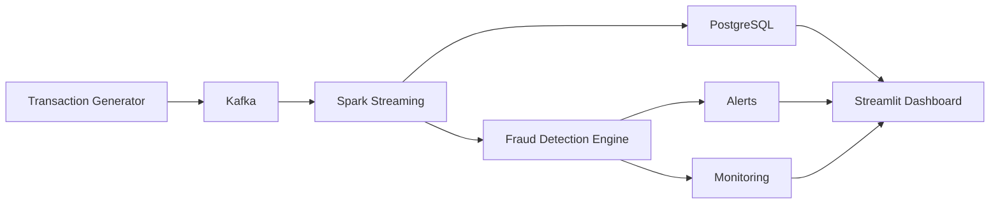

# 🚀 Fraud Detection Streaming Platform

Real-time fraud detection system built with a modern data stack: **Kafka + Spark Structured Streaming + PostgreSQL + Streamlit**.

---

## 📸 Overview

This project simulates a **real-world banking fraud detection system**, capable of ingesting, processing, and detecting anomalies in streaming transactions.

---

## 🏗️ Architecture

git clone https://github.com/your-repo/fraud-detection-platform.git
cd fraud-detection-platform
